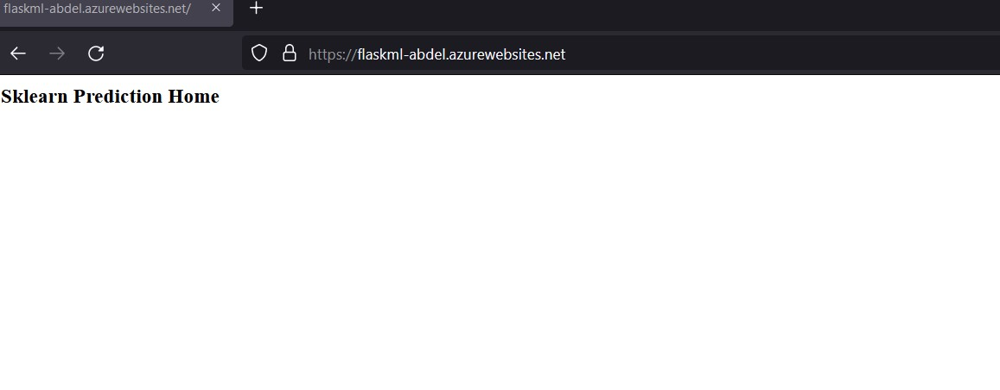

# Overview

This goal of this second project is to build a CI/CD pipeline using Azure Pipelines for a python-based ML application.

## Project Plan

- A link to a Trello board for the project

  - Checkout [Trello board](https://trello.com/b/vuXvrEjO)

- A link to a spreadsheet that includes the original and final project plan

  - Checkout [project-management-example.xlsx](./project/project-management.xlsx)

## Instructions

- Architectural Diagram (Shows how key parts of the system work)

- Project cloned into Azure Cloud Shell

  - Open Azure Cloud Shell, create a SSH key pair by: `ssh-keygen -t rsa`;

  - Copy and paste the public SSH key to github.com (e.g., the file `~/.ssh/id_rsa.pub`);

  - Run `git clone git@github.com:abdelino17/flask-ml-azure.git` to clone my repository into Azure Cloud Shell:

    

    

- Project running on Azure App Service

  - Go to the project directory: `cd flask-ml-azure`;

  - Run the Azure Webapp Service `az webapp up --sku F1 --name flaskml-abdel --location "France Central"` (so the webapp name is `flaskml-abdel`);

  - Wait until the webapp infrastructure is created and verify the frontend:

    

  - Replace the webapp name in [make_predict_azure_app.sh](make_predict_azure_app.sh)

- Passing tests that are displayed after running the `make all` command from the `Makefile`

- Output of a test run

  

  

  

- Successful deploy of the project in Azure Pipelines. [Note the official documentation should be referred to and double checked as you setup CI/CD](https://docs.microsoft.com/en-us/azure/devops/pipelines/ecosystems/python-webapp?view=azure-devops).

- Running Azure App Service from Azure Pipelines automatic deployment

  

- Successful prediction from deployed flask app in Azure Cloud Shell. [Use this file as a template for the deployed prediction](https://github.com/udacity/nd082-Azure-Cloud-DevOps-Starter-Code/blob/master/C2-AgileDevelopmentwithAzure/project/starter_files/flask-sklearn/make_predict_azure_app.sh).
  The output should look similar to this:

  

- Output of streamed log files from deployed application

  

  

## Enhancements

- Containerization (Docker, Azure Container Registry)

- Kubernetes version with Azure Kubernetes Service (AKS) for high availability

## Demo

- [Azure DevOps Building a CI/CD Pipeline](https://www.loom.com/share/d9baab500f7f46049134d4a7ddf1ac6f)
